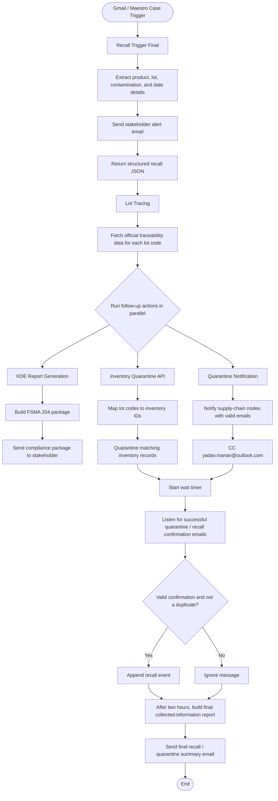

# Recall and Quarantine Workflow Guide

This document turns the raw agent notes into one explainable end-to-end flow.

## What this workflow does

The process starts when a food-safety case or email alert arrives. It extracts the product and lot details, traces the affected lot, runs quarantine-related follow-up actions in parallel, listens for confirmation emails, and then sends a final summary report.

In plain English:

1. Detect a recall signal.
2. Trace the lot to understand what is affected.
3. Quarantine inventory and notify supply-chain partners.
4. Wait for confirmation emails.
5. Send a final collected-information report.

## Main agents and responsibilities

| Agent | Input | Output | Purpose |
|---|---|---|---|
| Recall Trigger Final | Maestro case payload, inbound email details, attachments, product data, lot codes, and dates | Structured JSON with signal type, product, contamination, dates, and lot codes | Reads the case, classifies the risk, and sends the first stakeholder alert |
| Lot Tracing | Single lot code such as `LOT-2026-0437` | Full trace record with events, lab results, inventory, nodes, and recall class | Calls the traceability API workflow |
| KDE Report Generation | Lot trace data, case context, and attachments | FSMA 204 KDE data, FDA cover letter, internal recall summary, and content | Builds the FDA recall compliance package |
| Inventory Quarantine API | Lot codes plus trace data used to map inventory IDs | Quarantine summary, successful records, failures, and matched inventory IDs | Quarantines matching inventory records |
| Quarantine Notification | Trace data with supply-chain nodes and contact emails | Notification summary and per-node send results | Sends quarantine notifications to valid recipients |
| Recall Event Listener | Existing recall events, current email, and trace data | Updated recall event list and processing status | Appends only valid, non-duplicate confirmations |
| Final Report Sender | Confirmed recall or quarantine events | Email sent status, summary, and event count | Produces the final recall/quarantine report |

## End-to-end flow

### 1) Recall trigger

The workflow begins with a case or email that may include:

- sender, subject, and body
- product details
- lot codes
- production date range
- contamination text or lab results
- attachment metadata and extracted attachment text

The Recall Trigger Final agent does three things:

1. Extracts the important recall details.
2. Classifies the signal type, such as `SUPPLIER_ALERT`.
3. Sends one stakeholder notification email.

Input:

- Maestro case payload
- sender, subject, and body
- product details
- lot codes
- production date range
- attachments and extracted attachment text

Output:

- structured recall JSON
- signal type
- product name
- contamination type
- production date range
- lot codes

The expected output is a compact JSON object containing:

- `signalType`
- `productName`
- `contaminationType`
- `productionDateRange`
- `lotcodes`

### 2) Lot tracing

Next, the lot tracing step takes a single lot code, such as `LOT-2026-0437`, and returns the official traceability record.

The trace data includes:

- contamination type
- urgency
- recall class estimate
- production date
- origin facility
- raw materials
- critical tracking events
- LIMS results
- states affected
- supply chain nodes
- warehouse inventory
- incomplete KDE nodes

This step does not send email or change records. It only fetches trace data.

Input:

- one lot code, such as `LOT-2026-0437`

Output:

- full traceability payload
- contamination type
- critical tracking events
- LIMS results
- origin facility
- product details
- raw materials
- recall class estimate
- affected states
- supply chain nodes
- warehouse inventory
- incomplete KDE nodes

### 3) Parallel follow-up actions

After trace data is available, three branches run in parallel.

#### KDE Report Generation

This agent uses the trace data plus case context and attachments to create an FDA compliance package.

Input:

- lot trace data
- email or case context
- supporting attachments

It produces:

- FSMA 204 KDE data
- FDA cover letter
- internal recall summary
- incomplete field list
- final content for sharing

The package is sent to `yadav.manan@outlook.com`.

Output:

- FSMA 204 KDE data
- FDA cover letter
- internal recall summary
- incomplete field list
- final content for sharing

#### Inventory quarantine

The quarantine API branch looks inside the trace data to find inventory IDs tied to the affected lot codes.

Input:

- lot codes needing quarantine
- traceability data used to locate inventory IDs

It then:

1. Matches lot codes to inventory IDs.
2. Calls the quarantine API once for each matched inventory ID.
3. Marks the inventory record as quarantined.
4. Returns a summary of what succeeded and what was missing.

The output includes:

- quarantined records
- quarantine results
- lot codes not found
- matched inventory IDs
- counts for requested, matched, quarantined, failed, and missing items

Output:

- quarantined inventory records
- quarantine results
- not-found lot codes
- matched inventory IDs
- summary counts

#### Quarantine notification

This agent sends quarantine notifications to supply-chain nodes listed in the trace data.

Input:

- trace data
- supply-chain nodes
- contact emails when available

It:

1. Reviews the trace data.
2. Finds nodes that need quarantine notification.
3. Checks for a usable `contactEmail`.
4. Creates a tailored email per recipient type.
5. Sends the email.
6. Always CCs `yadav.manan@outlook.com`.

If a node has no valid email, it is skipped and the reason is recorded.

Output:

- notification summary
- notification count
- sent count
- per-node notification results

## Post-quarantine waiting period

After quarantine actions are triggered, a wait timer starts.

During the waiting period, another trigger listens for incoming emails that might confirm quarantine or recall actions.

This listener checks:

- whether the email is a valid confirmation
- whether lot, recipient, shipment, units, date, and reference data match the trace source of truth
- whether the event is a duplicate

It returns one of two outcomes:

- `APPEND_EVENT` when the confirmation is valid and new
- `IGNORE` when the message is invalid, incomplete, or a duplicate

Input:

- current recall events list
- current email being processed
- trace data as the source of truth

Output:

- action result
- updated recall events
- processed event when applicable
- processed summary

This step only updates the recall-event state. It does not send email or call other tools.

## Final report after two hours

After the wait period finishes, the workflow gathers all confirmed recall or quarantine events and sends a final report.

The report sender:

1. Validates the recalled event data.
2. Calculates summary metrics such as total events, total units, confirmed events, and unique recipients.
3. Identifies missing fields or gaps.
4. Builds a polished HTML report.
5. Sends it to `yadav.manan@outlook.com`.

Input:

- confirmed recall or quarantine shipment events

Output:

- email sent status
- recipient
- summary
- number of events processed

If there are no valid recall events, the report email is not sent.

## Key input and output shapes

### Recall trigger input

The trigger expects a `property1` object that can contain:

- case ID
- sender
- subject
- body
- supplier name
- product details
- lot codes
- production date range
- attachments
- extracted attachment text

### Recall trigger output

The trigger returns a summary object with:

- `content`
- `signalType`
- `productName`
- `contaminationType`
- `productionDateRange`
- `lotcodes`

### Lot tracing output

The lot tracing step returns a full traceability payload containing:

- contamination type
- critical tracking events
- expiry date
- KDE completeness
- LIMS results
- origin facility
- product details
- raw materials
- recall class estimate
- affected states
- supply chain nodes
- total units affected
- warehouse inventory

## Important notes

- The lot tracing prompt is written like it can handle multiple lots, but the current input behaves like a single lot code.
- The recall event listener only appends valid, non-duplicate confirmations.
- The quarantine notification agent never invents missing recipient emails.
- The final report only runs after the waiting period and only if valid recall events exist.

## Flow diagram

